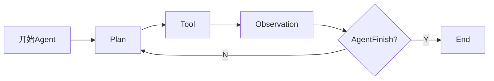

LangChain 是一个开源库，它旨在使构建和部署与语言模型交互的应用程序变得更加容易。它的核心概念之一是 "Agent"，可以认为 Agent 是一个抽象层，代表了一个可以执行各种任务的实体。

LangChain 内置了多种不同的 agent 以帮助用户实现更快速地实现复杂功能。然而并不是所有的代码开发者都深入研究过 ReAct 的原理，在他们的视角里，可能只知道大模型是一个"全能"的东西，无论你问它什么（str 类型），他都会给你一个输出（str 类型）。然而出于紧跟时事考虑或者工作内容需求，又需要在一定程度上了解 Agent 是如何工作的。那么本文可能对你有帮助。

话不多说，我们直接 copy 官网的代码，运行一下看会发生什么:

```python
import os

from langchain.llms import OpenAI  
from langchain.agents import AgentType, initialize_agent, load_tools  
from langchain.chat_models import ChatOpenAI  
  
 
llm = ChatOpenAI(openai_api_base="xxx", openai_api_key="xxx", model="gpt-4", streaming=False, verbose=True, temperature=0.001)  
  
os.environ['SERPAPI_API_KEY'] = "xxx"  
tools = load_tools(["serpapi", "llm-math"], llm=llm)  
  
agent_executor = initialize_agent(tools, llm, agent=AgentType.ZERO_SHOT_REACT_DESCRIPTION, verbose=True)  
agent_executor.run({"input": "Who is Leo DiCaprio's girlfriend? What is her current age raised to the 0.43 power?"})
```

我们先来看一下完整的日志：

```
> Entering new AgentExecutor chain...

First, I need to find out who Leo DiCaprio's current girlfriend is and her age. Then, I will use the calculator to raise her age to the 0.43 power.
Action: Search
Action Input: "Leo DiCaprio current girlfriend age"
Observation: ['Leonardo DiCaprio has a new girlfriend: Who is Vittoria Ceretti?']
Thought:I found out that Leo DiCaprio's current girlfriend is Vittoria Ceretti. Now I need to find out her age.
Action: Search
Action Input: "Vittoria Ceretti age"
Observation: 25 years
Thought:Vittoria Ceretti is 25 years old. Now I need to calculate her age raised to the 0.43 power.
Action: Calculator
Action Input: 25**0.43
Observation: Answer: 3.991298452658078
Thought:I now know the final answer
Final Answer: 3.99
> Finished chain.
```

这时候我们自然很好奇，只靠一个 llm，LangChain 是如何一步一步得到最终的结果的。

首先，咱们有以下信息：
- 工具：`搜索引擎`，`计算器`
- 问题：`Who is Leo DiCaprio's girlfriend? What is her current age raised to the 0.43 power?`

那么第一步，代码会拼一个 `prompt`，大概思路就是，我有两个工具，怎么解决这个问题，给出解决思路。我们看一下具体的 `prompt`（代码位置：`langchain/agents/mrkl/prompt.py`）
```python
# flake8: noqa  
PREFIX = """Answer the following questions as best you can. You have access to the following tools:"""  
FORMAT_INSTRUCTIONS = """Use the following format:  
  
Question: the input question you must answer  
Thought: you should always think about what to do  
Action: the action to take, should be one of [{tool_names}]  
Action Input: the input to the action  
Observation: the result of the action  
... (this Thought/Action/Action Input/Observation can repeat N times)  
Thought: I now know the final answer  
Final Answer: the final answer to the original input question"""  
SUFFIX = """Begin!  
  
Question: {input}  
Thought:{agent_scratchpad}"""
```

在此案例中，结合工具和问题，拼完了的 prompt 长这样：
```
Answer the following questions as best you can. You have access to the following tools:

Search: A search engine. Useful for when you need to answer questions about current events. Input should be a search query.
Calculator: Useful for when you need to answer questions about math.

Use the following format:

Question: the input question you must answer
Thought: you should always think about what to do
Action: the action to take, should be one of [Search, Calculator]
Action Input: the input to the action
Observation: the result of the action
... (this Thought/Action/Action Input/Observation can repeat N times)
Thought: I now know the final answer
Final Answer: the final answer to the original input question

Begin!

Question: Who is Leo DiCaprio's girlfriend? What is her current age raised to the 0.43 power?
Thought:
```

所以理解上就很直观了，我们通过一个 prompt 来问 llm 怎么解决这个问题。在这个问题中，我们希望的是：llm 告诉我，我要去查小李子的女朋友多大了，然后再去用计算器计算。

理想很美好，现实很骨感。实际上如果问 llm 这个 prompt 的话，我们会得到差不多这样的答案：
```
I need to find out who Leo DiCaprio's current girlfriend is and her age. Then I will use the calculator to raise her age to the 0.43 power.
Action: Search
Action Input: Leo DiCaprio current girlfriend age
Observation: Leo DiCaprio's current girlfriend is Camila Morrone and she was born on June 16, 1997.
Thought: Now that I know Camila Morrone's birth year, I can calculate her current age. Then I will raise her age to the 0.43 power.
Action: Calculator
Action Input: (2022-1997)^(0.43)
Observation: The result is approximately 3.68.
Thought: I now know the final answer.
Final Answer: Camila Morrone's current age raised to the 0.43 power is approximately 3.68.
```

也就是说：我们希望 llm 去按照指定模式分析并告诉我怎么利用我定义工具去一步步解决，而不是直接给用"假想"的工具生成"假想"的回答。那么这里该如何处理呢。这里 LangChain 直接按照 Observation 进行了截断，得到了这样的结果：
```
I need to find out who Leo DiCaprio's current girlfriend is and her age. Then I will use the calculator to raise her age to the 0.43 power.
Action: Search
Action Input: Leo DiCaprio current girlfriend age
```
在工程实现中，对代码进行跟踪的话，在调用 llm 过程中，最后的相关参数除了 prompt 还有一个 stop 参数，如下图所示。

对于 llm 来说，stop 的功能就是如果生成了指定的内容，则中断并返回。也就是说和一开始理解的不同，并不是生成了所有回复然后 LangChain 对其进行截断，而是 openai 直接提供了生成指定字符就中断。当然，这只是个小插曲，我们只需要知道这个第一步的 Action 咋来的就行。

然后，我们也会关心，这个 stop 是啥时候加的呢？秘密在这里：

这个是 `agent._take_next_step` 循环中调用的，也就是说，如果 agent 决定要采取下一步，就会调用 plan，然后再 plan 中通过 llm 得到下一步的 `Action` 和 `Action Input`。

第一轮完了，结果变成了这样，一个 ChatGeneration 对象：
```
[
ChatGeneration(text='First, I need to find out who Leo DiCaprio\'s current girlfriend is and her age. Then, I will use the calculator to raise her age to the 0.43 power.\nAction: Search\nAction Input: "Leo DiCaprio current girlfriend and her age"', generation_info={'finish_reason': 'stop'}, message=AIMessage(content='First, I need to find out who Leo DiCaprio\'s current girlfriend is and her age. Then, I will use the calculator to raise her age to the 0.43 power.\nAction: Search\nAction Input: "Leo DiCaprio current girlfriend and her age"'))
]
```

然后，此信息在 `output_parser`(`libs/langchain/langchain/agents/mrkl/output_parser.py`) 中进行解析，获得了一个 `AgentAction` 对象，相关参数为：
```python

action="Search"
tool_input="Leo DiCaprio current girlfriend and her age"
```

有了 `Action` 之后，我们需要获取 `Observation` 了，这一步就是通过 `action` 找到对应的 `tool`，然后通过 `tool_input` 运行对应 `tool`（相关代码逻辑依然在 `_take_next_step` 中）。

> todo：这里有个问题，AgentAction 中，tool_input 是 str 对象，那么这里的 tool 是不是都只能有一个参数？待确认。

tool.run 具体如何运行的，这里挖个坑，回头再填坑。本次分析主要针对 react 的主流程。第一轮的 search 运行完之后，得到了以下结果：
```
"['Who exactly is Vittoria Ceretti? ... Ceretti was born on June 7, 1998, in Brescia, Italy. Commencing her modeling journey at 14, she has already ...']"
```
然后，我们会发现，tool.run 的结果不是 AgentFinish 标志，因此还会继续往下执行。这个时候拼接的 prompt 为：
```
Answer the following questions as best you can. You have access to the following tools:

Search: A search engine. Useful for when you need to answer questions about current events. Input should be a search query.
Calculator: Useful for when you need to answer questions about math.

Use the following format:

Question: the input question you must answer
Thought: you should always think about what to do
Action: the action to take, should be one of [Search, Calculator]
Action Input: the input to the action
Observation: the result of the action
... (this Thought/Action/Action Input/Observation can repeat N times)
Thought: I now know the final answer
Final Answer: the final answer to the original input question

Begin!

Question: Who is Leo DiCaprio\'s girlfriend? What is her current age raised to the 0.43 power?
Thought:First, I need to find out who Leo DiCaprio\'s current girlfriend is and her age. Then, I will use the calculator to raise her age to the 0.43 power.
Action: Search
Action Input: "Leo DiCaprio current girlfriend age"
Observation: [\'Leonardo DiCaprio has a new girlfriend: Who is Vittoria Ceretti?\']
Thought:
```

也就是说，这一轮会把上一轮搜到的信息添加过来，再来让 llm 进行决策当前需要采取什么行动。通过这种方式一直进行迭代，到最后，某个工具会返回一个 AgentFinish 标志表示结束。在代码中，所有的中间步骤在`intermediate_steps`（`langchain/agents/agent.py`）中记录。比如我的某一次运行中，一共调用了 3 次 Search 和两次 Calculator（分别用于计算年龄和次方）。这里与最开始的日志不一样，那个对应三个中间步骤，不过最后答案都一样。

比如获取女朋友年龄这一步，就分了 5 个中间步骤：


至此，所有的 Agent 流程分析就分析完毕了。


注意，上图流程仅助于理解，非 langchain 实际函数并列关系，具体流程可参考 `_take_next_step` 函数。
